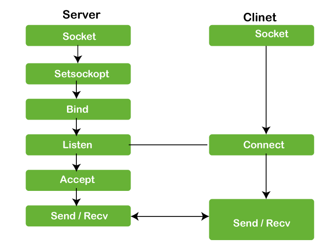
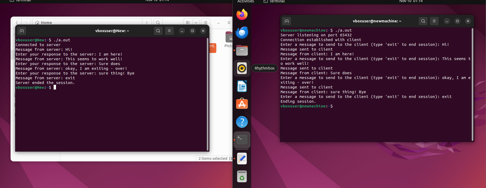
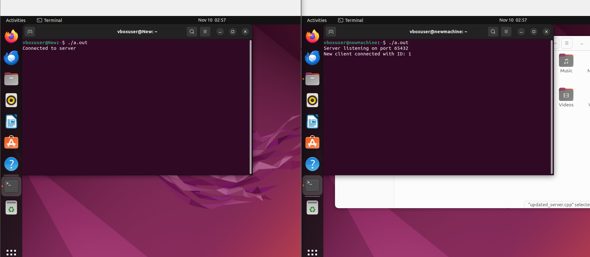

# Socket-Programming

## Description

This project demonstrates core concepts in socket programming, focusing on creating a multi-threaded server application. The server listens for incoming client connections and, upon accepting a connection, spawns a new thread to handle communication with each client. This design is often used in chat applications, networked games, and distributed systems where multiple clients interact with a central server.

The flow is best demonstrated by the following image:



image credit - Javatpoint.


## Getting Started

I used virtual machines for this project where I created 2 linux VMs(Ubuntu) with a shared NAT network and ran the server and client on it, you can create your environment as you see fit.

Dependencies
 * Operating System: Linux or macOS (Windows may require additional setup)
 * Compiler: g++ (This is what I used, you can choose what you like)
 * Libraries:
    * threads (thread.h) for threading support
    * Sockets (sys/socket.h and arpa/inet.h for network communication)
 * Development Environment: Recommended for Linux, though this can work on other platforms with some configuration adjustments.

 


### Installing

* Clone the repository:

```
git clone https://github.com/yourusername/socket-programming-project.git
cd socket-programming-project
```
  

### Executing program

* Compile the program first:
```
g++ server.cpp -o server
g++ client.cpp -o client
```
* Now we can run the server and client on two different terminals/VMs(edit the code for a local host if you want to try it on there):
```
./server 

./client
```

* The output would look like this:





  

## Authors

Srinath Ramachandran - email: Srinath.ramachandran26@gmail.com

Please reach out if you have any suggestions or improvements or ideas on creating any applications.

## Version History

* 0.1
    * Initial Release


## Acknowledgments

I did a lot of reading from the following sites, you can have a read it for your edification:

* https://www.geeksforgeeks.org/socket-programming-cc/
* https://www.geeksforgeeks.org/socket-programming-in-cpp/
* https://cplusplus.com/forum/general/58677/
* https://www.javatpoint.com/socket-programming-in-c-or-cpp

  
